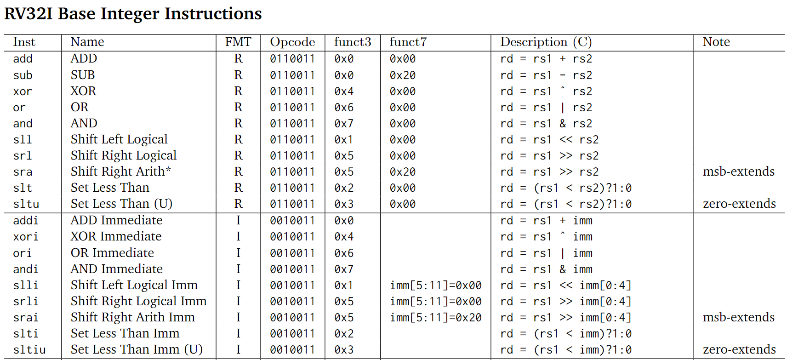

# Ibex Reference Model

## Quick Start

- Clone the repository:
    ```
    git clone https://github.com/DigitalDesign20232/Ibex-Reference-Model.git
    ```

- From the root directory, build with:
    ```
    make clean build
    ```

- From the root directory, run with:
    ```
    make run
    ```

- The initialized value of Register File, IMEM and DMEM can be changed in:
    - `register_file.mem`: Decimal
    - `imem.mem`: Binary
    - `dmem.mem`: Not implemented yet

## Feature

- Supported Extension:
    - RV32I:
        - R-Type
        - I-Type: Arithmetic operation

